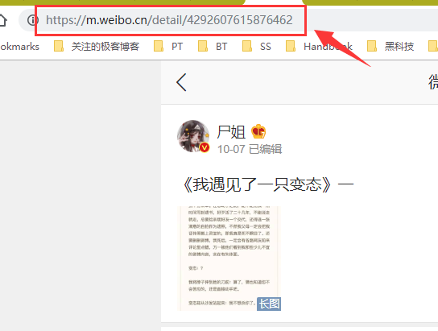
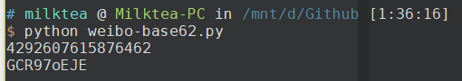
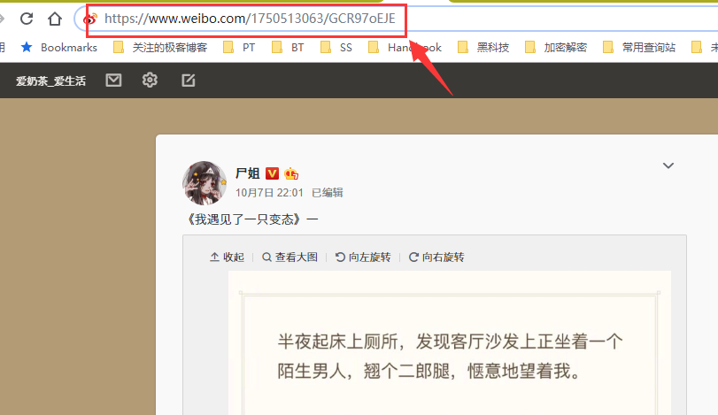

# README

## Thanks

技术分析来自这个大佬的博文，[点我](http://kawo-tech.tumblr.com/post/74682997654/using-base62-to-generate-a-sina-weibo-post)

## Screenshots

How does this script work?

1. 手机版分享的微博链接

   

2. 把后面的`id`扔到脚本里面

   

3. 然后就可以变成电脑版的链接了

   